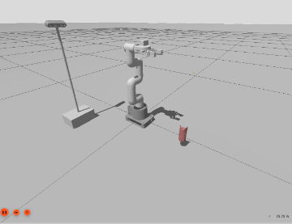
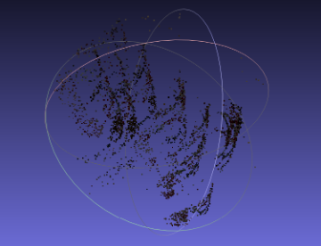
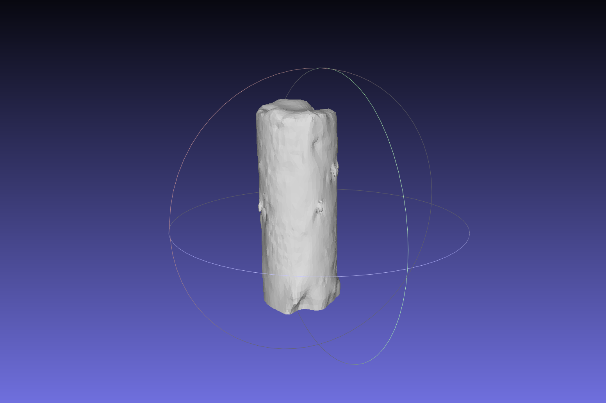
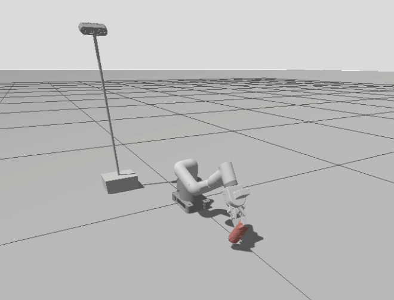

# 3D Reconstruction and Robotic Manipulation

> Individual project exploring computer vision, 3D reconstruction and robotic manipulation using ROS 2, MoveIt and VisualSFM.

---

## Overview

This project investigated a complete workflow for reconstructing a physical object from image data and integrating the reconstructed model into a robotic manipulation environment.

A video of a soup can was captured and processed using computer vision techniques to generate a 3D model. The reconstructed mesh was then imported into a UR5e MoveIt planning environment where motion planning and grasping experiments were performed.

The project combined concepts from:

- Computer Vision
- Structure from Motion (SfM)
- 3D Reconstruction
- Robotics
- Motion Planning
- ROS 2

---

## Project Objectives

The objectives of this project were to:

- Capture image data suitable for 3D reconstruction
- Reconstruct a physical object using Structure from Motion techniques
- Convert the reconstructed point cloud into a usable mesh
- Import the reconstructed object into a ROS 2 MoveIt environment
- Demonstrate robotic interaction with the reconstructed object

---

## Robot Environment



The reconstructed object was imported into a UR5e MoveIt planning scene as a collision object. Motion planning was then used to execute grasping and object manipulation tasks.

---

## 3D Reconstruction

The reconstruction process consisted of several stages:

1. Video capture
2. Frame extraction
3. Camera calibration
4. Feature detection and matching
5. Structure from Motion reconstruction
6. Point cloud generation
7. Mesh reconstruction
8. STL export

A combination of ROS 2 tools and VisualSFM was used throughout the reconstruction workflow.

---

## Point Cloud Reconstruction



The initial reconstruction generated a sparse point cloud representing the geometry of the soup can.

Due to the cylindrical symmetry of the object and the limited camera baseline between frames, reconstruction quality varied throughout the image sequence.

---

## Final Mesh



The reconstructed point cloud was processed into a mesh suitable for robotic applications.

Although the resulting model was not perfectly accurate, it successfully captured the overall cylindrical geometry of the object and could be imported into the MoveIt planning scene for collision-aware manipulation.

---

## Robotic Manipulation



The reconstructed STL model was imported into the MoveIt planning scene as a collision object before executing a robotic manipulation sequence.

A custom ROS 2 motion script (`grab_can.sh`) controlled the robot through the following stages:

- Open the gripper
- Approach the reconstructed object
- Close the gripper
- Lift and transport the object
- Release the object

The final demonstration achieved partial grasping and movement of the soup can, validating the complete reconstruction-to-manipulation workflow.

📹 **Demonstration Video**

`videos/manipulation-demo.mp4`

---

## Technical Challenges

Several practical challenges were encountered during the project:

### Cylindrical Symmetry

The soup can contained repeated visual features, making reliable feature matching more difficult.

### Low Camera Parallax

Consecutive video frames contained limited viewpoint variation, reducing reconstruction stability.

### Incomplete Geometry

The underside of the object was not fully visible during capture, resulting in missing mesh geometry.

### Manipulation Reliability

The reconstructed object could be manipulated within MoveIt; however, grasp stability remained limited due to reconstruction accuracy and grasp alignment.

---

## Technologies

- ROS 2
- MoveIt
- Python
- OpenCV
- VisualSFM
- Structure from Motion
- Mesh Processing
- STL Modelling
- UR5e Robot
- Bash

---

## Repository Structure

```
3d-reconstruction-robotic-manipulation/
│
├── images/
├── models/
├── reports/
├── scripts/
├── src/
├── videos/
└── README.md
```

---

## Project Files

This repository includes:

- ROS 2 workspace and source code
- Motion planning scripts
- Reconstructed STL model
- Engineering report
- Demonstration video
- Project images and reconstruction results

---

## Future Improvements

Potential improvements include:

- Improved image acquisition with greater camera parallax
- Multi-view image capture of hidden object surfaces
- More robust feature matching
- Higher-quality mesh reconstruction
- Automatic grasp pose estimation
- Closed-loop visual feedback for reliable grasping