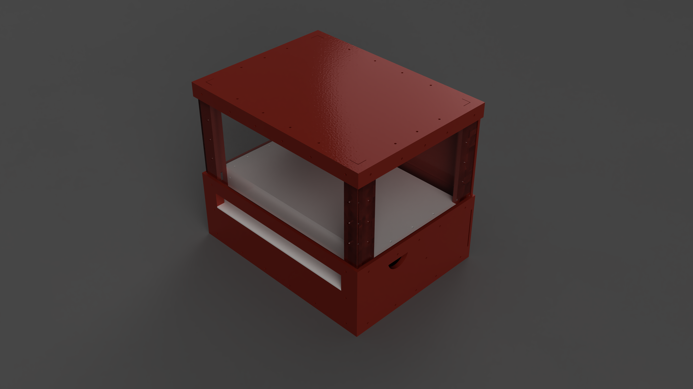
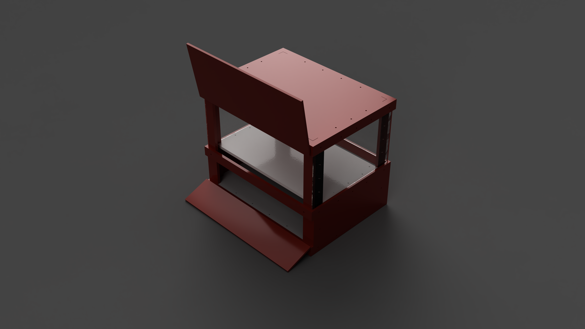
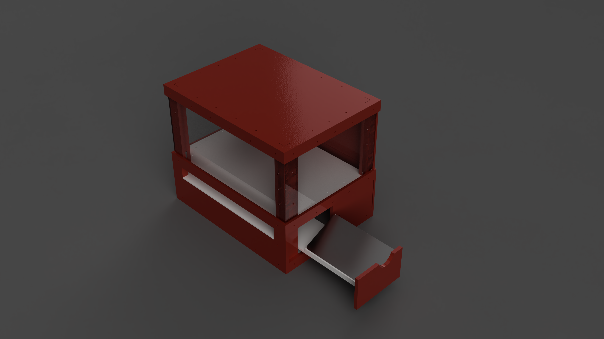
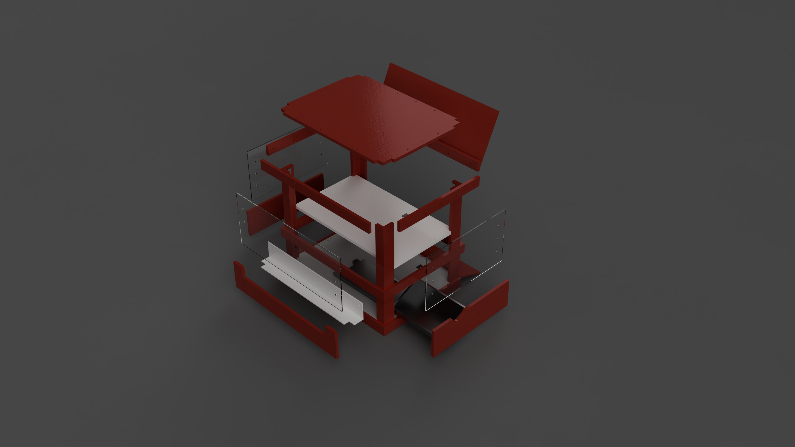
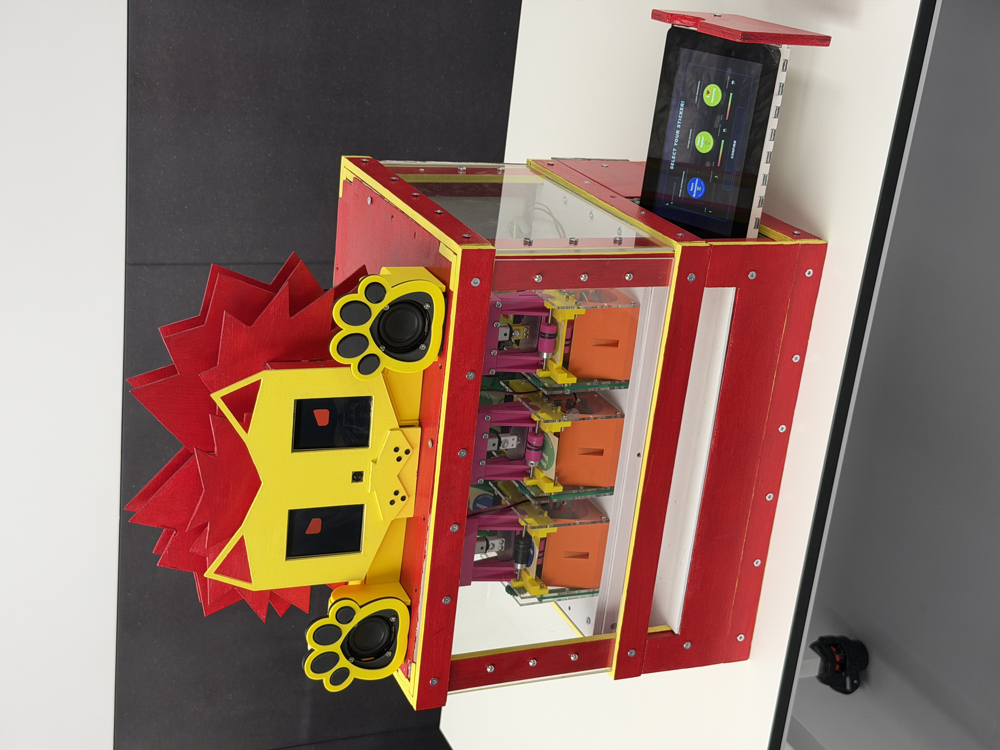

# Interactive Sticker Dispensing System

> Mechanical design and manufacture of an automated sticker dispensing system developed as part of a multidisciplinary engineering project at King's College London.



---

# Overview

This project involved the design, manufacture and integration of an automated sticker dispensing system intended for use in an educational environment.

Working within a multidisciplinary engineering team, I was responsible for the mechanical design of the chassis and enclosure. The enclosure was designed in Fusion 360 before being manufactured using laser-cut components and assembled into the final prototype.

The completed system incorporates:

- Automated sticker dispensing mechanism
- Retractable touchscreen interface
- Acrylic viewing panels
- Modular laser-cut chassis
- Internal battery and electronics housing

---

# My Contributions

My responsibilities included:

- Designing the complete chassis in Fusion 360
- Designing the enclosure around the dispensing mechanism
- Developing a retractable touchscreen drawer
- Designing removable access panels for maintenance
- Manufacturing laser-cut components
- Mechanical assembly
- Supporting system integration and validation

---

# Design Requirements

The enclosure was designed to satisfy several engineering requirements:

- Protect internal electronics and dispensing mechanisms
- Allow users to observe the internal system through acrylic panels
- Provide straightforward maintenance access
- Support a retractable touchscreen interface
- Be manufacturable using laser-cut sheet materials
- Allow repeatable assembly using modular components

---

# Design Decisions

Several design choices were made to improve functionality, manufacturability and maintenance.

### Retractable Touchscreen

The touchscreen was mounted on a sliding drawer to protect the display during transport while allowing convenient user interaction.

### Acrylic Viewing Panels

Transparent side panels allow users to observe the internal dispensing mechanism while protecting moving components.

### Modular Construction

The chassis was divided into laser-cut panels which simplified manufacturing, transport and replacement of damaged components.

### Serviceability

Rear access panels and removable sections were incorporated to simplify maintenance and battery replacement.

---

# CAD Development

## Overall Chassis


The enclosure was modelled entirely in Fusion 360 using a modular laser-cut construction. Structural members were designed to maximise rigidity while allowing straightforward assembly.

---

## Rear Access



The rear enclosure provides access to internal components for maintenance and servicing while maintaining structural integrity during normal operation.

---

## Retractable Touchscreen Drawer



A retractable drawer was incorporated into the design to house the touchscreen interface. This protects the display during transport while allowing convenient access during operation.

---

## Exploded Assembly



The exploded assembly illustrates the modular construction of the chassis and highlights the relationship between structural members, acrylic panels and internal support components.

---

# Final Prototype



The completed prototype was successfully manufactured, assembled and integrated as part of the final engineering project.

A demonstration video is included within the repository.

📹 **Demonstration Video**

`videos/final-demonstration.MOV`

---

# Engineering Documentation

This repository also contains:

- Fusion 360 CAD assemblies
- Manufacturing drawings
- Assembly drawings
- Individual engineering report
- Team project report

---

# Technical Skills Demonstrated

- Fusion 360
- Mechanical CAD
- Engineering Design
- Laser Cutting
- Prototype Manufacture
- Design for Manufacture (DFM)
- Mechanical Assembly
- System Integration
- Engineering Documentation

---

# Repository Structure

```
interactive-sticker-dispenser/
│
├── cad/
├── drawings/
├── images/
├── reports/
├── videos/
└── README.md
```